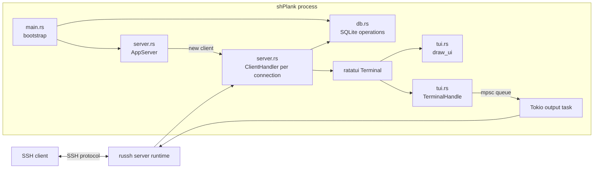
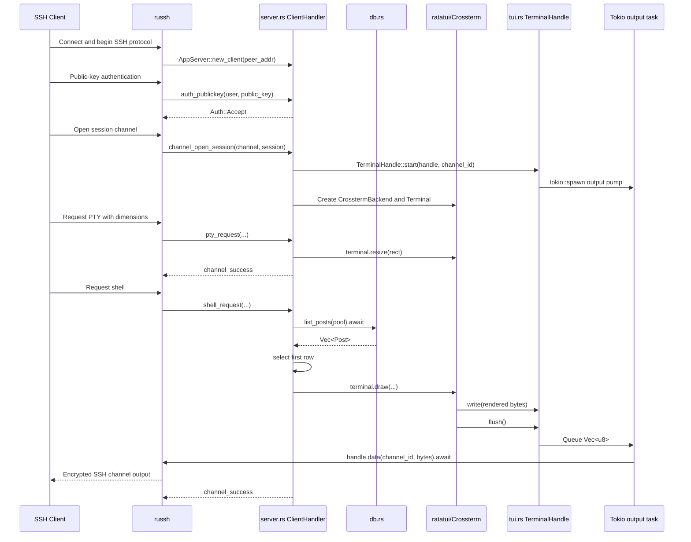

# shPlank Current Application Flow

> A current-state architecture and execution walkthrough for the Rust SSH TUI forum.
>
> This document is based on the supplied `main.rs`, `server.rs`, `tui.rs`, `db.rs`, and project context. It describes what the application does **now**, including startup, database initialization, SSH connection handling, data loading, rendering, input, resizing, and disconnect cleanup.

## 1. Executive summary

At its current stage, shPlank is a long-running asynchronous SSH server with four main layers:

| File | Current responsibility |
|---|---|
| `main.rs` | Starts Tokio, builds the SSH configuration, loads the server host key, initializes SQLite, seeds starter posts, constructs the server, and starts listening on port `2222`. |
| `db.rs` | Owns the SQLite-facing operations: open the pool, create the `posts` table, seed it when empty, and query posts. |
| `server.rs` | Connects `russh` events to the application. It creates one `ClientHandler` per SSH connection and handles authentication, session channels, PTY setup, shell startup, keyboard input, window resizing, and disconnect logging. |
| `tui.rs` | Draws the post list with `ratatui` and provides the adapter that turns ratatui output into bytes sent over the SSH channel. |

The shortest description of the runtime flow is:

```text
Process starts
  → Tokio runtime starts
  → SSH configuration and host key are prepared
  → SQLite pool opens
  → posts table is created if needed
  → starter posts are inserted if the table is empty
  → SSH listener starts on port 2222

Client connects
  → russh creates a ClientHandler
  → public key is accepted and fingerprint is saved
  → SSH session channel opens
  → ratatui terminal and SSH output bridge are created
  → PTY dimensions are applied
  → shell request loads posts from SQLite
  → draw_ui builds the post list
  → ratatui produces terminal control bytes
  → background task sends those bytes over SSH

Client presses a key
  → russh passes raw bytes to ClientHandler::data
  → q or Ctrl+C closes the channel
  → Up/Down changes ListState
  → screen is redrawn

Client disconnects
  → russh eventually drops ClientHandler
  → terminal bridge and queue sender are dropped
  → output task exits
  → ClientHandler::drop logs the disconnect
```

A particularly important mental model is that there are **two kinds of function calls** in this program:

1. **Direct application calls** — for example, `main()` directly calls `db::init()`.
2. **Framework callbacks** — for example, your code does not directly call `ClientHandler::shell_request()`. The `russh` library calls it when the SSH client asks to start a shell.

That difference explains much of the application flow.

---

## 2. Current project status shown by the code

The supplied project context describes SQLite and a scrollable post list as the next build step. The supplied source code has already implemented most of that step:

- SQLite is opened through `sqlx`.
- A `posts` table is created.
- Two starter posts are seeded.
- Posts are queried when a client starts a shell.
- Post titles are rendered as a stateful ratatui `List`.
- Up and Down move the highlighted selection.

The current application is therefore beyond a static TUI screen. It now has a database-backed post-title list, although it does not yet open a selected post or display post bodies and comments.

---

## 3. High-level architecture



The main process owns one listening server. Each SSH client gets independent session state:

```text
AppServer
├── next_id
└── shared SqlitePool handle
    ├── ClientHandler #1
    │   ├── fingerprint
    │   ├── ratatui Terminal
    │   ├── cloned SqlitePool handle
    │   ├── Vec<Post>
    │   └── ListState
    ├── ClientHandler #2
    │   ├── fingerprint
    │   ├── ratatui Terminal
    │   ├── cloned SqlitePool handle
    │   ├── Vec<Post>
    │   └── ListState
    └── ...
```

The clients share access to the database pool, but they do **not** share their currently loaded post vector, selected row, fingerprint, or terminal.

---

## 4. File-by-file responsibilities

### 4.1 `main.rs`: composition root and process bootstrap

`main.rs` answers the process-level questions:

- Which modules are part of the crate?
- Which async runtime runs the application?
- What SSH configuration is used?
- Which host key identifies the SSH server?
- How is the database initialized?
- Which object implements the SSH server?
- Which address and port does it listen on?

It contains:

```rust
mod server;
mod tui;
mod db;
```

These statements tell the Rust compiler to include the other source modules in the crate. They are closer to declaring project modules than to C# `using` directives. A `using` only imports names; `mod` tells Rust that the module exists.

The entry point is:

```rust
#[tokio::main]
async fn main() -> Result<(), Box<dyn std::error::Error>>
```

The `#[tokio::main]` macro creates and starts a Tokio async runtime, then runs the async `main()` future inside it. This is what makes `.await` legal in `main()`.

### 4.2 `db.rs`: persistence layer

`db.rs` contains:

- The Rust representation of a post row: `Post`.
- `init()` to open SQLite and create the schema.
- `seed_if_empty()` to insert two starter posts.
- `list_posts()` to retrieve all posts.

This module does not know anything about SSH, terminal rendering, selected rows, or clients. It accepts a `SqlitePool` reference and returns database data or an error.

### 4.3 `server.rs`: SSH event/controller layer

`server.rs` contains two distinct server-side types:

#### `AppServer`

This is the listener-level factory. It is not the state for one logged-in user.

It stores:

```rust
pub struct AppServer {
    next_id: usize,
    db: SqlitePool,
}
```

Its job is to retain resources needed to create new client handlers. Every time `russh` accepts a new client connection, it calls `AppServer::new_client()`.

#### `ClientHandler`

This is the per-connection state object:

```rust
pub struct ClientHandler {
    id: usize,
    fingerprint: Option<String>,
    terminal: Option<Terminal<CrosstermBackend<TerminalHandle>>>,
    db: SqlitePool,
    posts: Vec<Post>,
    list_state: ListState,
}
```

This type is the closest current equivalent to a per-user session/controller/view-model object.

It remembers:

- Which numbered connection this is.
- Which SSH key fingerprint authenticated.
- Whether the terminal has been created yet.
- How to reach SQLite.
- Which posts this client loaded.
- Which post is highlighted.

`russh` calls its `Handler` methods as protocol events occur.

### 4.4 `tui.rs`: rendering and SSH output transport

`tui.rs` has two separate jobs:

1. `draw_ui()` describes what should appear on the screen.
2. `TerminalHandle` implements `std::io::Write` so ratatui/crossterm can write terminal bytes somewhere that ultimately reaches the SSH client.

`draw_ui()` is presentation logic. `TerminalHandle` is an output adapter.

---

## 5. Complete process startup flow

## 5.1 Entry into `main()`

**File:** `main.rs`  
**Function:** `main()`

The executable starts at `main()`. Because of `#[tokio::main]`, Tokio first establishes an async runtime, then begins polling the `main()` future.

This runtime is needed for:

- `sqlx` database operations.
- The `russh` listener and connections.
- The background terminal-output task created later with `tokio::spawn`.
- Any `.await` points in the application.

In C# terms, Tokio fills a role somewhat comparable to the runtime infrastructure beneath `async Task Main()`, a socket server, a task scheduler, and asynchronous I/O completion. The exact implementation model is different, but the important idea is that `.await` does not block an entire operating-system thread while waiting for I/O.

## 5.2 Build the SSH configuration

**File:** `main.rs`  
**Function:** `main()`

The first statement constructs a `russh::server::Config`:

```rust
let config = Config {
    inactivity_timeout: Some(Duration::from_secs(3600)),
    auth_rejection_time: Duration::from_secs(3),
    keys: vec![load_or_generate_host_key()],
    ..Default::default()
};
```

Field evaluation includes an immediate call to:

```rust
load_or_generate_host_key()
```

The resulting private key is placed into a one-element vector and becomes the SSH server's host key.

The current configuration means:

- An inactivity timeout of 3,600 seconds is configured.
- Authentication rejection is deliberately delayed by three seconds.
- One host private key is supplied.
- Every other `Config` field uses the library default.

The host key identifies the **server**, not the connecting user. It is what lets an SSH client remember that it has reached the same server on later connections.

## 5.3 Load or create the host key

**File:** `main.rs`  
**Function:** `load_or_generate_host_key()`

The function uses the relative path:

```text
./server_key
```

The path is relative to the process's current working directory.

### Existing-key branch

If `server_key` exists:

```rust
PrivateKey::read_openssh_file(path)
```

reads it and returns the parsed private key.

If reading fails, `.expect(...)` panics and terminates the process with the supplied message.

### First-run branch

If the file does not exist:

1. An Ed25519 private key is generated using `rand`.
2. It is written in OpenSSH format with LF line endings.
3. A message is printed.
4. The generated key is returned.

The same file should be preserved across normal server restarts. Replacing it makes SSH clients see the service as a different host and may cause a host-key warning.

## 5.4 Open SQLite and establish the schema

**File:** `main.rs`  
**Direct call:** `db::init().await`  
**Implementation file:** `db.rs`  
**Function:** `init()`

`main()` now waits for:

```rust
let db = db::init().await?;
```

`db::init()` performs two database operations.

### Open the pool

```rust
SqlitePool::connect("sqlite:shplank.db?mode=rwc").await?
```

This opens a sqlx SQLite connection pool for the relative database file:

```text
./shplank.db
```

`mode=rwc` means read/write/create. The file is created if it does not already exist.

A `SqlitePool` is not one permanently borrowed connection. It is a cloneable handle that manages database connection access for async callers.

### Create the posts table

The function runs:

```sql
CREATE TABLE IF NOT EXISTS posts (
    id         INTEGER PRIMARY KEY,
    author_id  INTEGER NOT NULL,
    title      TEXT    NOT NULL,
    body       TEXT    NOT NULL,
    created_at TEXT    NOT NULL DEFAULT (datetime('now'))
)
```

`IF NOT EXISTS` makes repeated startups safe. It does not drop or recreate an existing table.

After execution succeeds, `init()` returns the pool:

```rust
Ok(pool)
```

If connection or schema creation fails, `?` returns the error from `init()`. The `?` in `main()` then propagates it again, and startup ends instead of starting a partially initialized server.

## 5.5 Seed starter data when empty

**File:** `main.rs`  
**Direct call:** `db::seed_if_empty(&db).await`  
**Implementation file:** `db.rs`  
**Function:** `seed_if_empty()`

The pool is borrowed as `&SqlitePool`; ownership remains in `main()`.

The function first asks SQLite for the row count:

```sql
SELECT COUNT(*) FROM posts
```

`query_scalar()` expresses that the result is a single value rather than a row-shaped struct. `fetch_one()` requires exactly one result row and returns it as `i64`.

If the count is zero, two separate parameterized insert operations execute.

The first creates:

```text
Title: Welcome to shPlank
Body:  This is the very first post. Pull up a chair.
```

The second creates:

```text
Title: How this works
Body:  Posts live in SQLite now. Soon you'll navigate them in a list.
```

Each `?` placeholder is filled using `.bind(...)`. This separates SQL text from values and avoids string-concatenating SQL.

If posts already exist, the function does nothing and returns `Ok(())`.

Because seeding happens before the listener starts, two clients cannot currently race to seed the empty table. The function is not transactional, but its present placement during single-process startup avoids the main race condition.

## 5.6 Perform the startup diagnostic query

**File:** `main.rs`  
**Direct call:** `db::list_posts(&db).await`  
**Implementation file:** `db.rs`  
**Function:** `list_posts()`

`main()` queries all posts:

```rust
let posts = db::list_posts(&db).await?;
println!("[db] loaded {} post(s)", posts.len());
```

`list_posts()` runs:

```sql
SELECT id, author_id, title, body, created_at
FROM posts
ORDER BY created_at DESC, id DESC
```

`sqlx::query_as::<_, Post>(...)` maps every result row to the `Post` struct through its `FromRow` derive.

The returned type is:

```rust
Vec<Post>
```

The query orders newest timestamps first, then higher IDs first when timestamps match.

At startup, this vector is used only to log the count. It is then allowed to go out of scope. It is **not** the vector later displayed to clients.

This distinction matters:

- Startup query: health/diagnostic count.
- Per-client shell query: actual snapshot displayed to that client.

## 5.7 Construct the listener-level server object

**File:** `main.rs`  
**Direct call:** `AppServer::new(db)`  
**Implementation file:** `server.rs`  
**Function:** `AppServer::new()`

`main()` transfers the pool into the application server:

```rust
let mut server = AppServer::new(db);
```

`AppServer::new()` stores:

```rust
Self {
    next_id: 0,
    db,
}
```

This is an ownership move. After this call, `AppServer` owns the `SqlitePool` handle previously stored in `main()`.

The actual SQLite database is not copied or moved on disk. Only the Rust pool handle changes owner.

## 5.8 Start listening

**File:** `main.rs`  
**Function:** `main()`  
**Library method:** `russh::server::Server::run_on_address()`

The configuration is wrapped in an `Arc`:

```rust
Arc::new(config)
```

`Arc` means atomically reference-counted shared ownership. It lets the library share one read-only configuration safely across concurrent connection tasks without copying the full config for each one.

Then the listener starts:

```rust
server
    .run_on_address(Arc::new(config), ("0.0.0.0", 2222))
    .await?;
```

`0.0.0.0` means listen on all IPv4 interfaces available to the machine. Port `2222` avoids conflicting with the administrative SSH service on port `22`.

Under normal operation, this `.await` remains active for the lifetime of the server. `main()` is effectively parked here while the library accepts and services connections.

If the listener returns an error, `?` propagates it from `main()`. If it returns successfully, `main()` returns `Ok(())`.

---

## 6. Exact startup call chain

```text
Operating system starts executable
└── Tokio-generated runtime wrapper
    └── main.rs: main()
        ├── main.rs: load_or_generate_host_key()
        │   ├── read existing server_key
        │   └── OR generate + persist Ed25519 server_key
        ├── db.rs: init().await
        │   ├── SqlitePool::connect(...).await
        │   └── CREATE TABLE IF NOT EXISTS posts
        ├── db.rs: seed_if_empty(&db).await
        │   ├── SELECT COUNT(*)
        │   └── optionally INSERT two starter rows
        ├── db.rs: list_posts(&db).await
        │   └── SELECT all posts newest-first
        ├── server.rs: AppServer::new(db)
        └── russh: run_on_address(...).await
            └── listener remains active
```

---

## 7. Complete client connection flow

Once `run_on_address()` is active, `russh` controls the next sequence. The exact low-level SSH packet exchange is inside the library, but the application-facing event order for a normal interactive SSH client is approximately:

```text
TCP/SSH connection accepted
  → AppServer::new_client
  → ClientHandler::auth_publickey
  → ClientHandler::channel_open_session
  → ClientHandler::pty_request
  → ClientHandler::shell_request
  → repeated data and/or window_change_request events
  → channel/connection closes
  → ClientHandler::drop
```

Some protocol events are client-dependent. For example, a noninteractive client might not request a PTY or shell. The current UI expects the normal interactive sequence.

## 7.1 Create a handler for the new connection

**File:** `server.rs`  
**Framework callback:** `AppServer::new_client()`

When a new client connection is accepted, `russh` calls:

```rust
fn new_client(
    &mut self,
    peer_addr: Option<std::net::SocketAddr>,
) -> ClientHandler
```

This function:

1. Increments `next_id`.
2. Copies the number into a local `id`.
3. Logs the peer address.
4. Constructs and returns a fresh `ClientHandler`.

Initial handler state:

| Field | Initial value | Meaning |
|---|---|---|
| `id` | Next connection number | Used for logging. |
| `fingerprint` | `None` | Authentication has not yet stored a key fingerprint. |
| `terminal` | `None` | No session channel/ratatui terminal exists yet. |
| `db` | `self.db.clone()` | This handler can query the shared SQLite pool. |
| `posts` | Empty vector | This client has not loaded posts yet. |
| `list_state` | Default state | Nothing is selected yet. |

Cloning `SqlitePool` does not create a second database and does not copy all data. It clones a lightweight reference-counted pool handle.

Each connection receives a separate `ClientHandler`, so one user's highlighted row does not move another user's highlighted row.

## 7.2 Authenticate the connecting public key

**File:** `server.rs`  
**Framework callback:** `ClientHandler::auth_publickey()`

When the client attempts public-key authentication, `russh` calls:

```rust
async fn auth_publickey(
    &mut self,
    user: &str,
    public_key: &PublicKey,
) -> Result<Auth, Self::Error>
```

The function:

1. Computes the SHA-256 fingerprint of the supplied public key.
2. Logs the connection ID, requested SSH username, and fingerprint.
3. Saves the fingerprint into the handler.
4. Returns `Auth::Accept`.

The assignment:

```rust
self.fingerprint = Some(fingerprint);
```

changes the lifecycle state from “not authenticated/no fingerprint captured” to “fingerprint available.”

The `Option<String>` is necessary because `ClientHandler` is created before authentication occurs. Rust requires the structure to have a valid value immediately, so the field starts as `None` and later becomes `Some(...)`.

Current security behavior:

```rust
Ok(Auth::Accept)
```

accepts **every valid public key**. The fingerprint is captured as identity groundwork, but it is not yet checked against a `users` table or allowlist.

The requested SSH username is currently logged but otherwise ignored.

## 7.3 Open an SSH session channel

**File:** `server.rs`  
**Framework callback:** `ClientHandler::channel_open_session()`

An SSH connection can contain channels. When the client asks for a session channel, `russh` calls:

```rust
async fn channel_open_session(
    &mut self,
    channel: Channel<Msg>,
    session: &mut Session,
) -> Result<bool, Self::Error>
```

This function constructs the rendering/output stack.

### Step A: obtain a clonable session handle

```rust
let handle = session.handle();
```

The borrowed `Session` object belongs to the callback. The returned `Handle` can be moved into a separately spawned async task and used later to send channel data.

### Step B: start the terminal-to-SSH bridge

```rust
let terminal_handle = TerminalHandle::start(handle, channel.id());
```

This enters `tui.rs`, creates an internal queue, and spawns an output task. The details are covered in Section 9.

### Step C: wrap the bridge in a crossterm backend

```rust
let backend = CrosstermBackend::new(terminal_handle);
```

Ratatui renders through a backend. `CrosstermBackend` knows how to convert ratatui frame changes into terminal control sequences and text bytes. Instead of writing to the server's local terminal, it writes into `TerminalHandle`.

### Step D: create a ratatui terminal

The initial viewport is fixed at 80 columns by 24 rows:

```rust
Viewport::Fixed(Rect::new(0, 0, 80, 24))
```

The terminal is then stored in the handler:

```rust
self.terminal = Some(Terminal::with_options(backend, options)?);
```

Again, `Option` models lifecycle. The handler exists before a session channel opens, so it initially has no terminal.

### Step E: accept the channel

```rust
Ok(true)
```

The callback reports that the session channel is accepted.

No post data is loaded and no UI is drawn yet. This callback only establishes the output machinery.

## 7.4 Apply the client's PTY size

**File:** `server.rs`  
**Framework callback:** `ClientHandler::pty_request()`

An interactive SSH client normally asks the server to allocate a pseudo-terminal and sends its current dimensions.

The callback receives:

- Terminal type string, currently ignored.
- Column count.
- Row count.
- Pixel dimensions, currently ignored.
- Terminal modes, currently ignored.
- Channel ID.
- Mutable SSH session.

It converts the dimensions to a ratatui `Rect`:

```rust
let rect = Rect::new(
    0,
    0,
    col_width as u16,
    row_height as u16,
);
```

If the terminal exists:

```rust
terminal.resize(rect)?;
```

updates the ratatui fixed viewport from the temporary 80×24 size to the client's actual terminal size.

Then:

```rust
session.channel_success(channel)?;
```

sends an SSH success response for the PTY request.

This callback does not draw the initial UI. Initial drawing happens on the later shell request.

## 7.5 Start the application shell and load posts

**File:** `server.rs`  
**Framework callback:** `ClientHandler::shell_request()`

When the client asks to start an interactive shell, the application treats that as “start the shPlank interface.”

This is where client-visible forum data is first loaded.

### Step A: query SQLite

```rust
self.posts = match crate::db::list_posts(&self.db).await {
    Ok(posts) => posts,
    Err(e) => {
        eprintln!("[db] failed to load posts: {e}");
        Vec::new()
    }
};
```

This calls:

**File:** `db.rs`  
**Function:** `list_posts()`

The query returns all post columns into `Vec<Post>`, newest first.

This vector belongs to this one handler. It is a snapshot taken when that client starts its shell.

If the query fails:

- The error is logged on the server.
- The client gets an empty `Vec<Post>`.
- The session continues.
- The UI draws an empty list rather than closing or showing an error message.

That differs from startup database errors, which are propagated and stop the server. Per-client load errors are caught and converted to an empty list.

### Step B: select the first post

If at least one post exists:

```rust
self.list_state.select(Some(0));
```

Ratatui list indexes are zero-based. `Some(0)` means the first item is highlighted.

If the vector is empty, selection remains `None`.

### Step C: draw the first frame

The handler borrows separate fields:

```rust
let posts = &self.posts;
let state = &mut self.list_state;
```

Then it invokes:

```rust
terminal.draw(|frame| draw_ui(frame, posts, state))?;
```

This is a useful Rust borrowing pattern:

- `posts` is borrowed immutably because drawing should not modify post data.
- `list_state` is borrowed mutably because a stateful widget may update state such as scrolling offset.
- `terminal` is borrowed mutably because drawing changes its internal previous-frame state and writes output.

Rust can permit these simultaneous borrows because they are disjoint fields of the same structure.

### Step D: acknowledge the shell request

After drawing:

```rust
session.channel_success(channel)?;
```

tells the SSH client that its shell request succeeded.

At this point, the client should see the shPlank post list.

---

## 8. Post data flow: SQLite row to screen title

The full data path for one post is:

```text
SQLite posts row
  → sqlx query result
  → db.rs Post struct
  → Vec<Post> in ClientHandler
  → tui.rs draw_ui()
  → p.title.clone()
  → ratatui ListItem
  → ratatui List
  → frame buffer
  → crossterm ANSI/control bytes
  → TerminalHandle::write()
  → TerminalHandle::flush()
  → Tokio mpsc queue
  → spawned output task
  → russh Handle::data()
  → encrypted SSH channel
  → user's terminal emulator
```

## 8.1 Database representation

A row contains:

```rust
pub struct Post {
    pub id: i64,
    pub author_id: i64,
    pub title: String,
    pub body: String,
    pub created_at: String,
}
```

All five fields are selected and loaded.

## 8.2 Current view representation

Only this field is currently used by the UI:

```rust
p.title
```

The ID, author ID, body, and timestamp are present in memory but not displayed.

This is why selecting a row currently changes only the highlight. There is not yet an Enter-key branch that uses the selected index to locate a `Post` and switch to a detail view.

---

## 9. Rendering flow in `tui.rs`

## 9.1 Build the terminal bridge

**File:** `tui.rs`  
**Function:** `TerminalHandle::start()`

This function is called once for the session channel from `channel_open_session()`.

It creates an unbounded multi-producer/single-consumer channel:

```rust
let (sender, mut receiver) = unbounded_channel::<Vec<u8>>();
```

This is an in-process queue, not the SSH channel itself.

- `sender` is stored inside `TerminalHandle`.
- `receiver` is moved into a spawned async task.

Then:

```rust
tokio::spawn(async move {
    while let Some(data) = receiver.recv().await {
        if let Err(e) = handle.data(channel_id, data).await {
            eprintln!("failed to send data to client: {e:?}");
            break;
        }
    }
});
```

creates a concurrent output pump.

Its loop means:

1. Wait asynchronously for one rendered byte buffer.
2. Send that buffer to the correct SSH channel.
3. Repeat.
4. Exit if sending fails.
5. Also exit when every sender is dropped and `recv()` returns `None`.

The `async move` transfers ownership of `receiver`, `handle`, and `channel_id` into the task. They remain valid even after `TerminalHandle::start()` returns.

Finally, `TerminalHandle` is returned with:

- The queue sender.
- An empty byte accumulation buffer called `sink`.

## 9.2 `TerminalHandle` implements `std::io::Write`

Ratatui's crossterm backend expects an output destination implementing the standard synchronous `Write` trait.

SSH sending through `russh` is async.

`TerminalHandle` bridges those incompatible interfaces:

```text
Synchronous Write calls
  → accumulate bytes
  → enqueue complete buffer synchronously
  → async task performs actual SSH send
```

### `write()`

**File:** `tui.rs`  
**Trait method:** `TerminalHandle::write()`

```rust
self.sink.extend_from_slice(buf);
Ok(buf.len())
```

Each write appends bytes to the current frame buffer. No network I/O occurs here.

The crossterm backend may call `write()` many times while producing one screen update.

### `flush()`

**File:** `tui.rs`  
**Trait method:** `TerminalHandle::flush()`

```rust
let data = std::mem::take(&mut self.sink);
```

`mem::take` replaces `sink` with a new empty vector and returns the old filled vector. This moves the completed buffer without cloning all its bytes.

Then:

```rust
self.sender.send(data)
```

places the frame bytes onto the in-process queue.

The async pump eventually receives the vector and awaits:

```rust
handle.data(channel_id, data).await
```

That library call sends SSH channel data to the client.

## 9.3 Draw one frame

**File:** `tui.rs`  
**Function:** `draw_ui()`

Signature:

```rust
pub fn draw_ui(
    frame: &mut ratatui::Frame,
    posts: &[Post],
    list_state: &mut ListState,
)
```

The function receives:

- The current ratatui frame being composed.
- A borrowed slice of posts.
- Mutable list-selection state.

### Build list items

```rust
let items: Vec<ListItem> = posts
    .iter()
    .map(|p| ListItem::new(p.title.clone()))
    .collect();
```

For each `Post`, it clones the title string and creates a `ListItem`.

The clone gives each temporary `ListItem` owned text for this frame. The source `Post` remains in `ClientHandler.posts`.

### Configure the list widget

The list receives:

- The generated items.
- A border on all sides.
- The title `shPlank`.
- A cyan border.
- A black-on-cyan selected row.
- The prefix `> ` for the selected row.

### Render the stateful widget

```rust
frame.render_stateful_widget(
    list,
    frame.area(),
    list_state,
);
```

The list occupies the entire available frame.

It is “stateful” because rendering uses `ListState` to know:

- Which index is selected.
- Which section of a longer list should be visible when scrolling is required.

`draw_ui()` does not directly write SSH packets. It describes the desired screen into ratatui's frame.

## 9.4 What `Terminal::draw()` adds around `draw_ui()`

The call in `server.rs`:

```rust
terminal.draw(|frame| draw_ui(frame, posts, state))
```

roughly performs these conceptual operations:

1. Start a new logical frame.
2. Give the closure a mutable `Frame`.
3. `draw_ui()` fills that frame's buffer with the desired widgets.
4. Ratatui compares the new buffer to the previous frame.
5. It emits terminal commands for changed cells through `CrosstermBackend`.
6. The backend calls `TerminalHandle::write()` one or more times.
7. The backend flushes.
8. `TerminalHandle::flush()` queues the complete byte buffer.
9. The background task sends it over SSH.

The terminal client interprets the received ANSI/crossterm sequences and updates its visible screen.

---

## 10. Initial client rendering sequence diagram



---

## 11. Keyboard input flow

**File:** `server.rs`  
**Framework callback:** `ClientHandler::data()`

After the shell starts, raw bytes sent by the terminal client arrive through:

```rust
async fn data(
    &mut self,
    channel: ChannelId,
    data: &[u8],
    session: &mut Session,
) -> Result<(), Self::Error>
```

This is not a high-level “key pressed” event. It is a slice of bytes. A single callback may contain one byte, an escape sequence, or potentially multiple bytes.

## 11.1 Quit handling runs first

```rust
if data.contains(&b'q') || data.contains(&0x03) {
    session.close(channel)?;
    return Ok(());
}
```

The two current quit inputs are:

- Lowercase `q`, byte `0x71`.
- Ctrl+C, byte `0x03`.

The code checks whether those bytes occur **anywhere** in the received slice.

If found:

1. It asks `russh` to close the channel.
2. It returns immediately.
3. It does not process arrows.
4. It does not redraw.

This is appropriate for the current read-only list, but it will matter when text entry is added: typing any text packet containing lowercase `q` would close the session unless input handling becomes mode-aware.

## 11.2 Arrow-key handling

Terminals encode arrow keys as escape sequences. The application recognizes two common variants for each direction:

```text
Up:   ESC [ A    or    ESC O A
Down: ESC [ B    or    ESC O B
```

In byte-string notation:

```rust
b"\x1b[A"
b"\x1bOA"
b"\x1b[B"
b"\x1bOB"
```

The code first gets the number of loaded posts:

```rust
let len = self.posts.len();
```

It only processes navigation when `len > 0`.

The current selected index is:

```rust
self.list_state.selected().unwrap_or(0)
```

If selection is unexpectedly `None`, navigation treats it as index zero.

### Up

```rust
selected.saturating_sub(1)
```

A normal unsigned subtraction at zero would underflow. `saturating_sub(1)` stays at zero instead.

### Down

```rust
(selected + 1).min(len - 1)
```

The candidate next index is clamped to the last valid index.

The result is placed back into `ListState` with:

```rust
self.list_state.select(Some(new_index));
```

## 11.3 Redraw after input

Unless the input caused an early quit, the code redraws the UI:

```rust
terminal.draw(|frame| draw_ui(frame, posts, state))?;
```

This currently happens even for unrecognized input. Ratatui's diffing should prevent a full screen payload when nothing changed, but the application still performs the draw call.

No database query occurs during navigation. The arrows move through the vector already stored in this client's handler.

## 11.4 Exact arrow-key flow

```text
User presses Down
  → terminal emulator sends escape bytes
  → encrypted SSH packet reaches russh
  → russh calls server.rs ClientHandler::data()
  → quit-byte check does not match
  → posts.len() is checked
  → current selected index is read
  → index is incremented and clamped
  → ListState is updated
  → Terminal::draw() calls tui.rs draw_ui()
  → selected row style moves
  → changed terminal bytes are queued
  → output task sends bytes over SSH
  → client terminal displays moved highlight
```

---

## 12. Window resize flow

**File:** `server.rs`  
**Framework callback:** `ClientHandler::window_change_request()`

After initial PTY setup, resizing the local terminal window causes the SSH client to send updated dimensions.

The callback:

1. Creates a new `Rect`.
2. Resizes the ratatui terminal.
3. Immediately redraws the post list.

```text
User resizes window
  → SSH client reports new rows/columns
  → russh calls window_change_request()
  → ratatui viewport changes size
  → draw_ui() lays the list into the new frame area
  → terminal diff bytes are sent over SSH
```

Unlike `pty_request()`, this callback does not call `session.channel_success()`. It handles the notification and returns `Ok(())`.

The new frame area returned by `frame.area()` means the list border always expands or contracts to fill the full terminal viewport.

---

## 13. Client disconnect and cleanup flow

There is no explicit `channel_close()` callback in the supplied code. Cleanup relies primarily on Rust ownership and `Drop`.

## 13.1 User quits with `q` or Ctrl+C

The `data()` callback calls:

```rust
session.close(channel)?;
```

This closes the SSH channel. The surrounding SSH session is then cleaned up by `russh` according to the connection lifecycle.

When the `ClientHandler` is no longer needed, the library drops it.

## 13.2 Client closes its terminal or network connection

If the client application exits, the network disappears, or the SSH connection otherwise ends, `russh` eventually releases the per-connection handler.

No special application call is required for ordinary memory cleanup.

## 13.3 `ClientHandler::drop()`

**File:** `server.rs`  
**Automatically invoked method:** `Drop::drop()`

```rust
impl Drop for ClientHandler {
    fn drop(&mut self) {
        println!("[disconnect] client #{}", self.id);
    }
}
```

Rust calls this automatically when ownership of the handler ends and it is being destroyed.

The explicit behavior is only a log message, but dropping the fields also triggers transitive cleanup:

```text
ClientHandler dropped
├── fingerprint String dropped
├── posts Vec<Post> dropped
├── ListState dropped
├── cloned SqlitePool handle dropped
└── Terminal dropped
    └── CrosstermBackend dropped
        └── TerminalHandle dropped
            ├── sink Vec<u8> dropped
            └── mpsc sender dropped
```

When the final sender for the terminal queue disappears, the background task's:

```rust
receiver.recv().await
```

returns `None`. The `while let Some(data)` loop ends, and the spawned output task returns.

This is a central Rust pattern: the type/ownership structure encodes resource cleanup. There is no garbage collector waiting to decide when these session resources should be reclaimed.

## 13.4 Timing nuance

`Drop` logs when the `ClientHandler` itself is released, not necessarily at the exact instant the user presses `q`. `session.close(channel)` initiates channel closure; `russh` still controls the protocol/session teardown.

Also, SSH technically supports multiple channels within one connection. The current application is designed around the normal single interactive session. Closing its channel will normally cause the client interaction to end, after which the connection handler is dropped.

## 13.5 Inactivity timeout

The SSH configuration includes a one-hour inactivity timeout. If `russh` determines the connection has been inactive according to that setting, it can terminate the inactive session, eventually causing the same handler-drop cleanup.

## 13.6 Stopping the entire server

The console message says Ctrl+C stops the server. There is no application-defined signal handler or graceful-shutdown function in the supplied code.

At present, pressing Ctrl+C in the server's own console relies on normal operating-system/process interruption behavior. This is separate from a remote client sending Ctrl+C through its SSH channel.

---

## 14. Exact per-client callback reference

| Approximate order | File | Function | Called by | Purpose |
|---:|---|---|---|---|
| 1 | `server.rs` | `AppServer::new_client()` | `russh` | Allocate a fresh per-connection handler and clone the DB pool handle. |
| 2 | `server.rs` | `ClientHandler::auth_publickey()` | `russh` | Compute/store the user's key fingerprint and accept authentication. |
| 3 | `server.rs` | `ClientHandler::channel_open_session()` | `russh` | Create the terminal output bridge, crossterm backend, and ratatui terminal. |
| 4 | `tui.rs` | `TerminalHandle::start()` | `channel_open_session()` | Create the byte queue and spawn the async SSH output pump. |
| 5 | `server.rs` | `ClientHandler::pty_request()` | `russh` | Apply the initial client terminal dimensions. |
| 6 | `server.rs` | `ClientHandler::shell_request()` | `russh` | Load posts, select the first one, and draw the initial UI. |
| 7 | `db.rs` | `list_posts()` | `shell_request()` | Query every post into `Vec<Post>`, newest first. |
| 8 | `tui.rs` | `draw_ui()` | `Terminal::draw()` closure | Build and render the post-title list for one frame. |
| 9 | `tui.rs` | `TerminalHandle::write()` | Crossterm backend | Accumulate output bytes. |
| 10 | `tui.rs` | `TerminalHandle::flush()` | Crossterm backend | Move accumulated bytes onto the queue. |
| 11 | `tui.rs` spawned task | output loop | Tokio scheduler | Await queued frames and send them with `russh::Handle::data()`. |
| Repeated | `server.rs` | `ClientHandler::data()` | `russh` | Process raw input, navigate, quit, and redraw. |
| Repeated | `server.rs` | `ClientHandler::window_change_request()` | `russh` | Resize the terminal and redraw. |
| Final | `server.rs` | `ClientHandler::drop()` | Rust automatically | Log disconnect and release per-connection resources. |

The table shows the normal interactive path, but network protocol callbacks should not be understood as a guaranteed ordinary function stack. They happen at different times as events arrive.

---

## 15. Direct call graph versus callback graph

## 15.1 Direct application call graph

These are calls clearly initiated by your own functions:

```text
main.rs: main
├── main.rs: load_or_generate_host_key
├── db.rs: init
├── db.rs: seed_if_empty
├── db.rs: list_posts
├── server.rs: AppServer::new
└── russh: run_on_address

server.rs: channel_open_session
└── tui.rs: TerminalHandle::start
    └── tokio::spawn(output pump)

server.rs: shell_request
├── db.rs: list_posts
└── ratatui Terminal::draw
    └── tui.rs: draw_ui

server.rs: data
└── ratatui Terminal::draw
    └── tui.rs: draw_ui

server.rs: window_change_request
├── ratatui Terminal::resize
└── ratatui Terminal::draw
    └── tui.rs: draw_ui
```

## 15.2 Framework callback graph

Your code registers behavior by implementing traits:

```text
russh Server trait
└── AppServer::new_client

russh Handler trait
├── ClientHandler::auth_publickey
├── ClientHandler::channel_open_session
├── ClientHandler::pty_request
├── ClientHandler::shell_request
├── ClientHandler::data
└── ClientHandler::window_change_request

std::io::Write trait
├── TerminalHandle::write
└── TerminalHandle::flush

std::ops::Drop trait
└── ClientHandler::drop
```

The trait implementations are similar in purpose to implementing an interface in C#, but Rust traits can also provide compile-time generic behavior and are used heavily to connect types to library frameworks.

---

## 16. Async and concurrency model

Three major async areas exist.

## 16.1 The listener

`run_on_address(...).await` keeps the process available for incoming connections.

While `main()` is awaiting the listener, Tokio can continue polling connection tasks and output tasks. Awaiting does not mean the whole program is frozen.

## 16.2 Async handler callbacks

The handler methods such as:

- `auth_publickey()`
- `channel_open_session()`
- `shell_request()`
- `data()`

are async because the SSH framework supports asynchronous event handling.

The database load in `shell_request()` genuinely waits for asynchronous I/O:

```rust
crate::db::list_posts(&self.db).await
```

While it waits, Tokio can run other ready work, including another client's activity.

## 16.3 Per-terminal output pump

Every accepted session channel creates a spawned task that waits on rendered output and forwards it to that client's SSH channel.

This separates:

- Ratatui's synchronous `Write` interface.
- Russh's asynchronous `handle.data(...).await` interface.

Without this bridge, the synchronous rendering call could not directly `.await` an SSH network send.

## 16.4 Per-client independence

A slow or idle client has its own handler state and output queue. Other clients have separate handlers and queues.

The shared item is the database pool. sqlx coordinates database access through the pool.

The post vectors are snapshots. If one client connects, then a new post is inserted through some future feature, an already-connected client will not automatically see it because there is no refresh query or publish/subscribe mechanism yet.

---

## 17. Rust ownership and borrowing in the current design

## 17.1 Ownership transfer into `AppServer`

```rust
AppServer::new(db)
```

moves the pool handle out of `main()` and into `AppServer`.

## 17.2 Cheap pool cloning into handlers

```rust
db: self.db.clone()
```

gives each handler its own owned pool handle. The underlying pool internals are shared.

This avoids giving a handler a borrowed reference tied to the lifetime of `AppServer`.

## 17.3 Optional lifecycle resources

```rust
fingerprint: Option<String>
terminal: Option<Terminal<...>>
```

These fields cannot exist immediately with meaningful values:

- The fingerprint arrives during authentication.
- The terminal is constructed when a session channel opens.

`Option` makes those states explicit and forces code to check whether a value exists.

## 17.4 Borrowing the pool for queries

Database functions take:

```rust
pool: &SqlitePool
```

They temporarily borrow the handle and do not consume it.

## 17.5 Moving query results into the handler

```rust
self.posts = posts;
```

moves the newly returned vector into per-client storage. No deep clone of all post rows is required at that assignment.

## 17.6 Separate immutable and mutable UI borrows

During drawing:

```rust
let posts = &self.posts;
let state = &mut self.list_state;
```

The post data is read-only; selection state may mutate. This communicates intent to the compiler and prevents accidental modification of posts in the drawing function.

## 17.7 Automatic destruction

When `ClientHandler` is dropped, Rust recursively drops owned fields. This deterministic cleanup replaces many explicit `Dispose()`/`using` patterns familiar from C#.

---

## 18. Error-handling flow

The code uses two different error strategies.

## 18.1 Startup errors are fatal

Examples:

```rust
db::init().await?;
db::seed_if_empty(&db).await?;
db::list_posts(&db).await?;
run_on_address(...).await?;
```

The `?` operator means:

```text
On success → unwrap the success value and continue.
On error   → return early from the current function with that error.
```

Since `main()` returns a broad boxed error type, errors from these operations can terminate startup and be reported to the caller/runtime.

Host key operations use `.expect(...)` instead, which panics with a specific message.

## 18.2 Per-client post-load errors are degraded

Inside `shell_request()`, a database error is caught:

```rust
Err(e) => {
    eprintln!("[db] failed to load posts: {e}");
    Vec::new()
}
```

The client remains connected and receives an empty list.

This keeps the entire server alive if one query fails, but the user currently receives no on-screen indication that the database failed.

## 18.3 Rendering and SSH callback errors propagate

Calls such as:

```rust
terminal.draw(...)?
terminal.resize(rect)?
session.channel_success(channel)?
session.close(channel)?
```

propagate errors from the handler callback to `russh`.

The output pump treats a send failure differently: it logs the failure and exits its loop.

---

## 19. What the application currently displays

The current screen is one full-window `List`:

```text
┌ shPlank ───────────────────────────────┐
│> Most recent post title               │
│  Older post title                     │
│                                       │
└───────────────────────────────────────┘
```

Current visual behavior:

- Cyan border.
- Black-on-cyan highlighted row.
- `> ` before the selected item.
- Titles ordered newest first.
- List uses the entire terminal area.
- Ratatui manages scrolling as selection moves beyond the visible region.

Current controls:

| Input | Behavior |
|---|---|
| Up Arrow | Select previous post; stops at the first row. |
| Down Arrow | Select next post; stops at the last row. |
| `q` | Close the SSH channel. |
| Ctrl+C | Close the SSH channel. |
| Terminal resize | Resize and redraw the list. |
| Other input | No state change, but a redraw is attempted. |

There is not yet a visible footer or help text advertising these controls.

---

## 20. Current limitations and important future implications

These are not necessarily bugs at this learning stage; they are consequences of the current implementation.

### 20.1 Authentication accepts every public key

The fingerprint is captured, but authorization is not enforced. Any user with any key can enter.

### 20.2 The fingerprint is not connected to database rows

`author_id` is currently hard-coded to `1` in starter rows. There is no `users` table lookup or first-login workflow yet.

### 20.3 Posts are loaded only when the shell starts

Each client gets one snapshot. There is no automatic refresh, manual refresh key, or live update when another client creates a post.

### 20.4 Only titles are rendered

The body, author ID, timestamp, and post ID are loaded but unused.

### 20.5 No view-mode state machine exists yet

The handler currently always represents one screen: the post list.

The future detail/composer implementation will likely add a field similar to:

```text
current_view = PostList | PostDetail | NewPost | NewComment
```

Input behavior can then depend on the active view.

### 20.6 The quit check is byte-based and global

`data.contains(&b'q')` closes on any packet containing lowercase `q`. That will conflict with future text input.

### 20.7 Arrow matching assumes complete exact sequences

The code compares the entire received `data` slice to one escape sequence. Network/input framing does not always promise that every logical key arrives as exactly one callback with no neighboring bytes.

A future event decoder, crossterm event parser, or buffered input parser will be more robust.

### 20.8 Unrecognized keys still redraw

This is harmless at current scale, but it is extra work.

### 20.9 The output queue is unbounded

`unbounded_channel()` does not apply backpressure. Under normal human-speed UI use this is unlikely to matter. A rapidly redrawing application combined with a stalled client could accumulate queued buffers.

### 20.10 Database and key paths depend on the working directory

Both are relative:

```text
./shplank.db
./server_key
```

When deployed through systemd, the service's `WorkingDirectory` will determine where those files are read and created.

### 20.11 Empty-list and DB-error screens look the same

A legitimate empty forum and a failed post query both produce an empty list.

### 20.12 Disconnect behavior is implicit

There is no custom EOF, channel-close, or connection-close callback. `Drop` logging is simple and effective, but explicit close hooks may become useful for presence tracking or auditing.

### 20.13 Server shutdown is not explicitly graceful

There is no cancellation token, signal listener, or database shutdown sequence. Process Ctrl+C relies on external termination behavior.

---

## 21. Example server log timeline

A representative first run might resemble:

```text
Generated a new host key at ./server_key
[db] loaded 2 post(s)
shPlank SSH server listening on 0.0.0.0:2222 — Ctrl-C to stop
[connect]    client #1 from Some(192.168.1.50:54321)
[auth]       client #1 user='josh' key=SHA256:...
[disconnect] client #1
```

What is happening between the authentication and disconnect log but is not currently logged:

```text
channel_open_session
TerminalHandle::start
pty_request
shell_request
db::list_posts
initial terminal.draw
one or more data callbacks
one or more terminal.draw calls
optional window_change_request callbacks
```

Adding temporary trace logs to those callbacks can be useful while learning the event sequence, but the current flow can already be derived from the trait implementations.

---

## 22. One complete user session, narrated

1. The server process is already waiting inside `run_on_address()`.

2. A user runs an SSH command targeting port `2222`.

3. `russh` accepts the network connection and asks `AppServer` for a handler.

4. `AppServer::new_client()` creates client number 1. It starts with no fingerprint, no terminal, no posts, and no selection.

5. The client offers a public key. `auth_publickey()` fingerprints it, stores the fingerprint, logs it, and accepts it.

6. The client opens a session channel. `channel_open_session()` creates a `TerminalHandle`.

7. `TerminalHandle::start()` creates an in-process output queue and launches a Tokio task waiting for rendered byte buffers.

8. The `TerminalHandle` is wrapped in `CrosstermBackend`, which is wrapped in a ratatui `Terminal`.

9. The client requests a PTY and reports its dimensions. `pty_request()` resizes the terminal to match.

10. The client requests a shell. `shell_request()` queries SQLite through `db::list_posts()`.

11. sqlx converts each row to a `Post` and returns `Vec<Post>`.

12. The handler stores that vector and selects index zero.

13. `Terminal::draw()` calls `draw_ui()`.

14. `draw_ui()` converts every title into a `ListItem`, constructs the bordered `List`, and renders it using `ListState`.

15. Ratatui/crossterm writes terminal bytes into `TerminalHandle`.

16. `TerminalHandle::flush()` queues the complete buffer.

17. The spawned output task receives the buffer and sends it through the correct SSH channel.

18. The user's local terminal renders the list.

19. The user presses Down. Raw escape bytes arrive in `ClientHandler::data()`.

20. The selected index moves from zero to one.

21. The application draws another frame. Ratatui sends the necessary differences, and the highlight visibly moves.

22. The user presses `q`.

23. `data()` asks `russh` to close the channel and returns without drawing.

24. Once the connection/session lifecycle is complete, `ClientHandler` is dropped.

25. Its `Drop` implementation logs the disconnect.

26. Dropping the terminal drops the output queue sender. The output task sees the queue close and exits.

27. The process itself continues listening for client number 2.

---

## 23. Suggested mental model for future work

As the project grows, it may help to think of the existing pieces in familiar application-layer terms:

| Current Rust object/module | Rough higher-level analogy |
|---|---|
| `main.rs` | Composition root / `Program.cs` startup |
| `AppServer` | Listener-level service and connection factory |
| `ClientHandler` | Per-connection controller + session state + view model |
| `db.rs` functions | Repository/data-access functions |
| `Post` | Data transfer/domain row model |
| `draw_ui()` | View renderer |
| `ListState` | UI state for selection and scrolling |
| `TerminalHandle` | Transport adapter/output stream |
| Tokio output task | Async writer pump |
| `russh Handler` callbacks | Framework/controller lifecycle events |

This is only an analogy. In the current small project, responsibilities are intentionally combined more than they would be in a larger application.

The next major structural change will probably be the addition of an explicit application/view state. At that point:

- `ClientHandler::data()` will interpret input based on the active view.
- The selected post index or ID will drive the detail query/view.
- Rendering may dispatch to functions such as `draw_post_list()` and `draw_post_detail()`.
- Composer modes will require a real input event parser so ordinary letters, including `q`, can be typed safely.

---

## 24. Compact function index

### `main.rs`

#### `main()`

Starts the runtime-controlled application flow, prepares SSH configuration, initializes data, creates `AppServer`, and awaits the listener.

#### `load_or_generate_host_key()`

Reads `server_key` or generates and persists an Ed25519 host key.

### `db.rs`

#### `Post`

The row model for the `posts` table.

#### `init()`

Opens `shplank.db`, creates the `posts` table if absent, and returns `SqlitePool`.

#### `seed_if_empty()`

Counts posts and inserts two starter rows when the table is empty.

#### `list_posts()`

Selects all post columns, maps them to `Post`, and orders newest first.

### `server.rs`

#### `AppServer::new()`

Creates the listener-level server state with connection numbering and database access.

#### `AppServer::new_client()`

Framework callback that creates one new `ClientHandler`.

#### `ClientHandler::auth_publickey()`

Framework callback that fingerprints and accepts a public key.

#### `ClientHandler::channel_open_session()`

Framework callback that creates the terminal rendering/output stack.

#### `ClientHandler::pty_request()`

Framework callback that applies initial terminal dimensions.

#### `ClientHandler::shell_request()`

Framework callback that loads posts and draws the initial list.

#### `ClientHandler::data()`

Framework callback that processes quit and Up/Down input, then redraws.

#### `ClientHandler::window_change_request()`

Framework callback that resizes and redraws.

#### `ClientHandler::drop()`

Automatic destructor hook that logs disconnection.

### `tui.rs`

#### `TerminalHandle::start()`

Creates the rendered-byte queue and starts the asynchronous SSH output pump.

#### `TerminalHandle::write()`

Accumulates bytes generated by the terminal backend.

#### `TerminalHandle::flush()`

Moves accumulated bytes onto the output queue.

#### `draw_ui()`

Builds and renders the current post-title list.

---

## 25. Final condensed lifecycle

```text
SERVER LIFETIME
main
  → host key
  → database/schema
  → seed
  → AppServer
  → listen forever

CONNECTION LIFETIME
new_client
  → auth_publickey
  → channel_open_session
  → TerminalHandle + output task
  → pty_request
  → shell_request
  → query posts
  → initial draw
  → data / resize / redraw loop
  → close
  → Drop

FRAME LIFETIME
Terminal::draw
  → draw_ui
  → ratatui frame diff
  → CrosstermBackend
  → TerminalHandle::write
  → TerminalHandle::flush
  → mpsc queue
  → output task
  → russh channel
  → client terminal
```
